# **Event Management and Booking Platform**

Welcome to the Event Management and Booking Platform! This system empowers admins, organizers, and attendees to manage and participate in events seamlessly. With real-time ticket booking, advanced analytics, and multi-tenant support, this platform is designed for scalability and an exceptional user experience.

---

## **Features**

### 🔑 **Home**
- **User Authentication**: Secure login and registration for all users.
- **Event Discovery**: Easily browse events by category, date, or location.

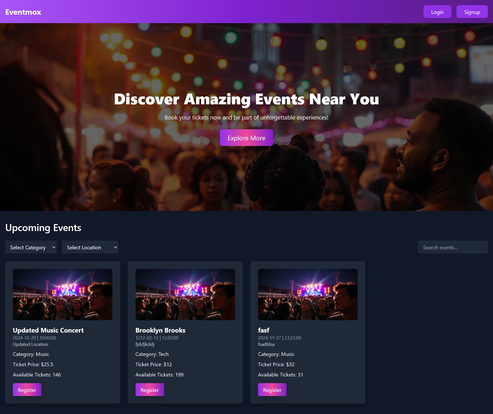  
*Homepage showcasing event categories and user options.*

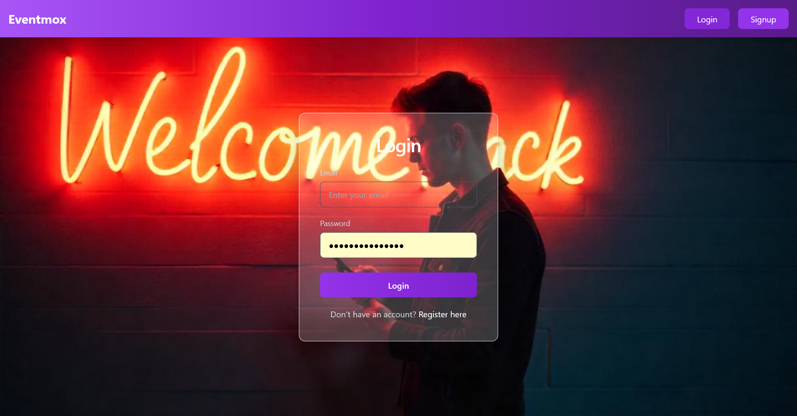  
*Login page for users to securely access the platform.*

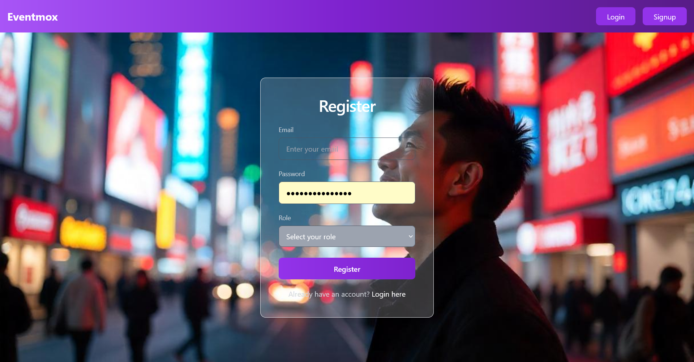  
*Registration page for new users.*

---

### 👩‍💼 **Admin Panel**
- **Dashboard**: Get an overview of all events, bookings, and platform activity.
- **Event Management**: View and manage all events across the platform.
- **Booking Insights**: Monitor booking trends and statuses in real-time.

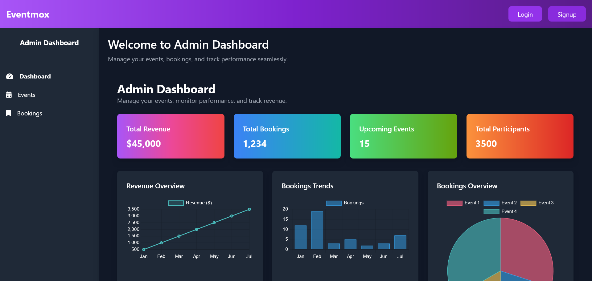  
*Admin dashboard displaying key metrics and insights.*

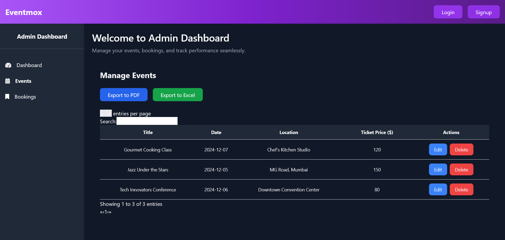  
*Page for admins to view and manage all platform events.*

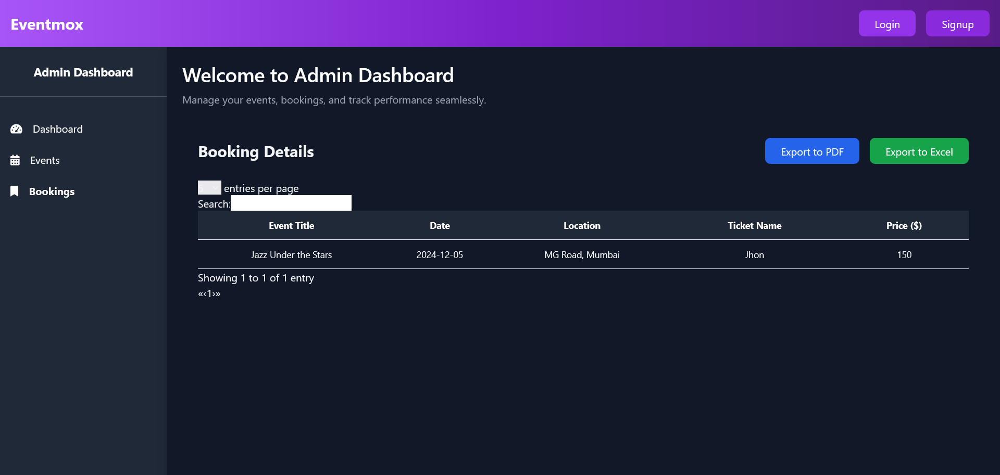  
*Admin interface to monitor and manage bookings.*

---

### 🎤 **Organizer Panel**
- **Dashboard**: Manage your events efficiently with detailed insights.
- **Add Events**: Create and configure new events with ease.
- **Bookings Overview**: Track event bookings and attendee details.

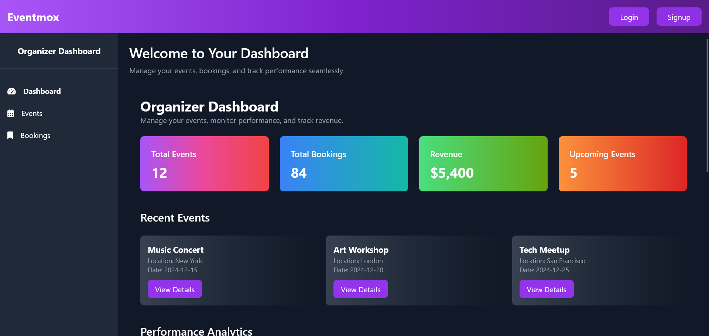  
*Organizer dashboard providing a summary of their events and bookings.*

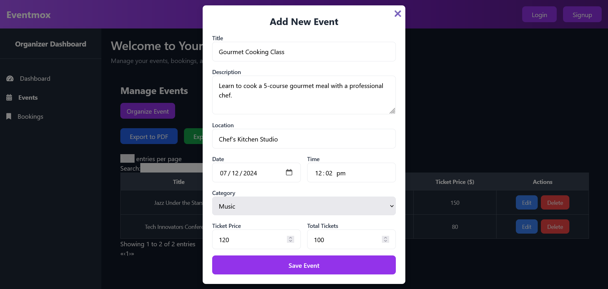  
*Popup interface for adding a new event.*

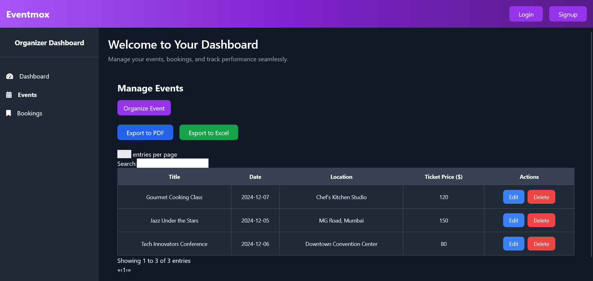  
*Event creation form with fields for title, date, and more.*

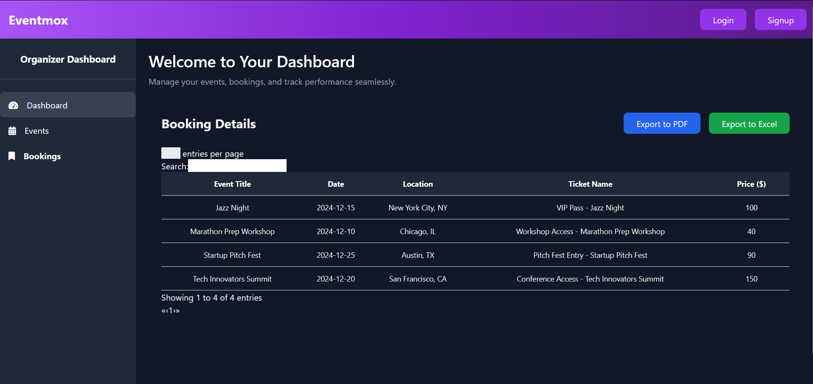  
*Bookings page showing attendee details for specific events.*

---

### 🧑‍🤝‍🧑 **Attendee Panel**
- **Dashboard**: View your personalized event experience.
- **Event Browsing**: Discover and register for upcoming events.
- **Bookings Management**: Track your tickets and booking details.
- **Payment Gateway**: Seamless and secure ticket purchases.
- **Event Ticket**: Access your event ticket directly within the platform.

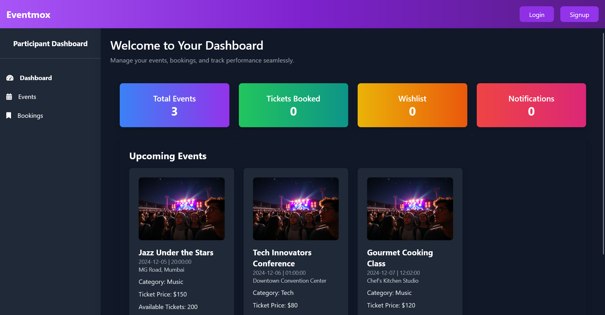  
*Personalized attendee dashboard with quick access to events and tickets.*

  
*Explore and browse all available events.*

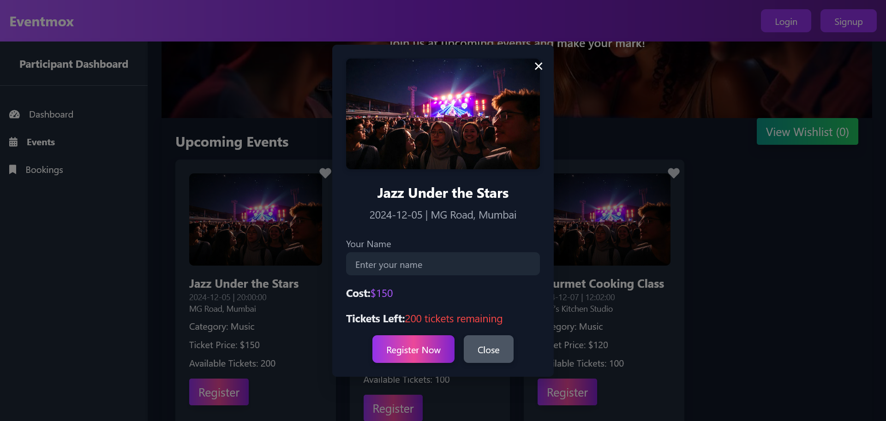  
*Register for an event through a simple interface.*

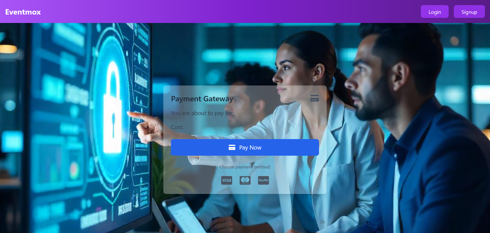  
*Secure and seamless payment gateway for ticket purchases.*

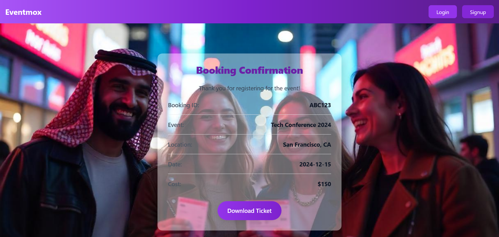  
*View and access your ticket directly after booking.*

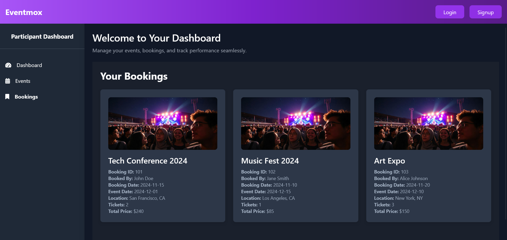  
*Manage and track all your bookings in one place.*

---

## **Tech Stack**

- **Frontend**: Angular with Tailwind CSS for a responsive and modern user interface.
- **Backend**: Golang with `net/http` for fast, scalable RESTful APIs.
- **Database**: MySQL for reliable data storage and query handling.

---

## **Installation**

### 1️⃣ Prerequisites
- Node.js (for the frontend)
- Go (for the backend)
- MySQL (for the database)

### 2️⃣ Clone the Repository
```bash
git clone https://github.com/abhisheksinghf/Algomox-golang-angular
cd your-repository
```

### 3️⃣ Install Frontend Dependencies
```bash
cd frontend
npm install
```

### 4️⃣ Set Up Backend
- Configure MySQL database credentials in the backend environment file.
- Run the Go server:
```bash
cd backend
go run main.go
```

### 5️⃣ Run the Application
- Start the frontend server:
```bash
cd frontend
npm start
```

